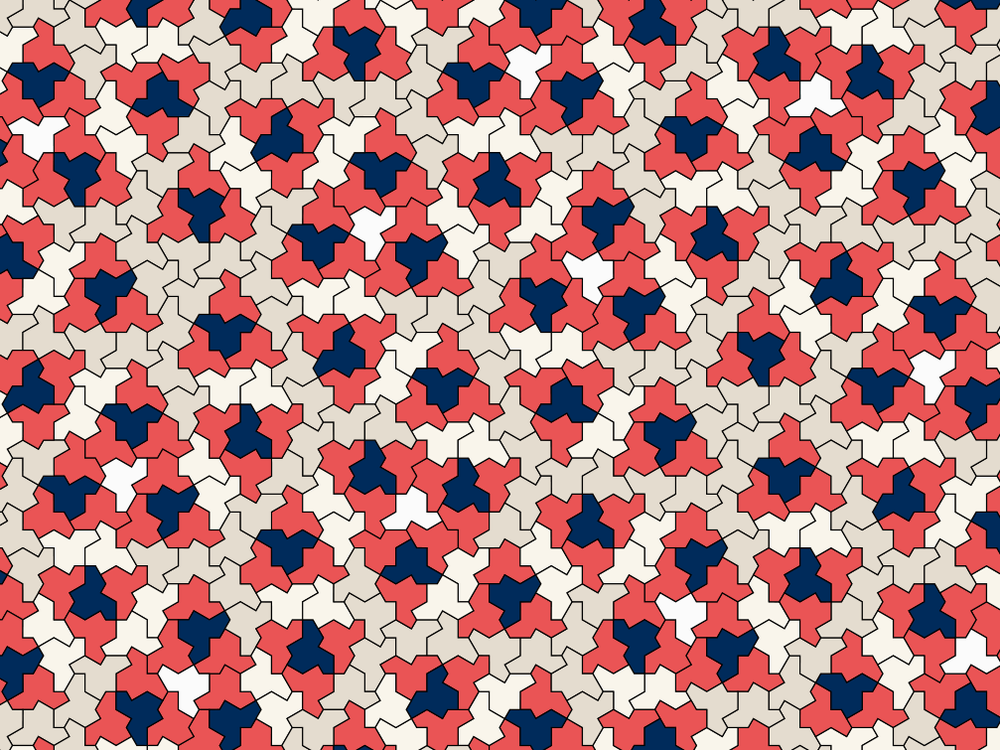

## Hodina 23. júna 2023

Program:

1. Úvodné reči - čo budeme robiť a ako a či nás poslúcha konferenčný systém
2. Testy z prijímačiek na MFF UK - čo vieme a čo nie.
3. Zopár príkladov

### 1. Úvod

**Tento text** a texty k nasledujúcim cvičeniam budú vyložené - ako pdf - v Github repozitári https://github.com/PKvasnick/Erik. Odporúčam Github Desktop (na Windows) pre uloženie a synchronizáciu repozitára. 

**Telekonferencia** Mám prvé skúsenosti s telekonferenčným systémom z DoucMa.sk: Niekedy zle funguje zdieľanie obrazovky. Ak to bude pretrvávať alebo sa objavia iné problémy, prejdeme na SpeakApp.

### 2. Testy z prijímačiek

Používam tieto: https://fmph.uniba.sk/studium/prijimacie-konanie/prihlasky/prijimacie-skusky-zadania-a-riesenia/. Prejdeme ich pomaly a skúsime nájsť riešenia a popritom zistiť, čomu sa treba venovať. 

### 3. Príklady

**Príklad 1**

Postupnosť začína číslami 1, 3, 6, 10. Doplň ďalšie členy. 

Ako u väčšiny príkladov, ktoré budeme riešiť, nezaujíma nás až tak veľmi konkrétny príklad, ale stratégie a postupy, ktoré sa dajú použiť. 

**Príklad 2**

Platí
$$
\sqrt{25} = 2 + 5 - 2 \quad (\textrm{odčítame dvojku od druhej odmocniny}) \\
= 5\\
\sqrt{64} = 6 + 4 - 2 = 8\\
\sqrt{196} = 1 + 6 + 9 - 2 = 14\\
\sqrt{289} = 2 + 8 + 9 - 2 = 17
$$
Je toto nová fantastická finta na odmocňovanie? Ako to funguje? Pre aké najväčšie číslo to môže platiť?

**Príklad 3**

Majme postupnosť $x_{n+1} = a\cdot x_n(1-x_n)$. Ako sa správa pre rôzne $a$?

### Kuriozita

Matematici objavili mnohouholník, ktorým sa dá pokryť rovina, ale nevytvára žiadny pravidelný vzor.  

https://www.smithsonianmag.com/smart-news/at-long-last-mathematicians-have-found-a-shape-with-a-pattern-that-never-repeats-180981899/