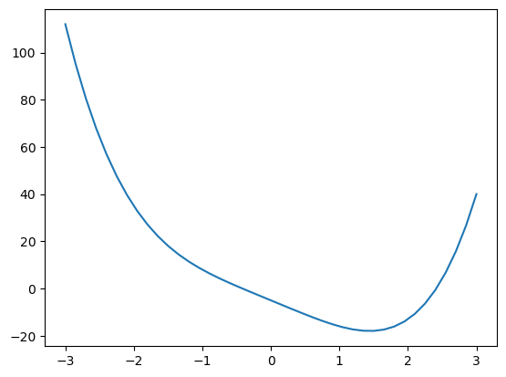
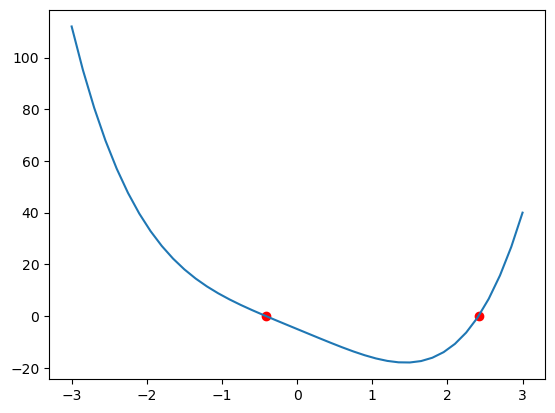

## Hodina 4. augusta 2023

Program:

1. Domáca úloha (z minula)
2. Niekoľko príkladov na zahriatie a pozdvihnutie mysli.
3. Dôkazy. Princíp dobrého usporiadania.
4. Domáca úloha (nová)

### 0. Úvod

**Tento text** a texty k nasledujúcim cvičeniam budú vyložené - ako pdf - v Github repozitári https://github.com/PKvasnick/Erik. Odporúčam Github Desktop (na Windows) pre uloženie a synchronizáciu repozitára. 

**Videohovor** Používame SpeakApp, link postnem vždy pred hodinou, *_je možné, že sa bude týždeň od týždňa líšiť_*.

### 1. Domáca úloha

**Príklad 1**. Dokážte, že pre všetky kladné čísla $a, b$ platí 
$$
\frac{a+b}{2}\ge \sqrt{ab}
$$
**Riešenie**

*_Intuitívny dôkaz_*
$$
\frac{a+b}{2}- \sqrt{ab} = \frac{1}{2}\left( a - 2\sqrt{ab} + b \right) = \frac{1}{2}\left( \sqrt{a} - \sqrt{b} \right)^2 \ge 0
$$
pre všetky kladné a, b, pričom rovnosť nastáva iba v prípade $a=b$.

*_Formálny dôkaz_*

Nech x, y sú ľubovoľné nezáporné čísla. Potom existujú odmocniny $\sqrt{x}, \sqrt{y}$ a sú tiež nezáporné, a platí
$$
\frac{1}{2}(\sqrt{x}-\sqrt{y})^2 \ge 0 \\ 
\implies \frac{1}{2}x - \sqrt{xy} + \frac{1}{2}y \ge 0 \\
\implies \frac{x + y}2 \ge \sqrt{xy}
$$
čím sme platnosť tvrdenia dokázali.

---

**Príklad 2** Dokážte, že pre prirodzené $n$ je $\log_7{n}$ celé alebo iracionálne číslo.

**Riešenie**

Dôkaz vykonáme sporom. Nech pre nejaké n je $\log_7{n} = p/q$, kde p, q sú nesúdeliteľné celé čísla, pričom $q >1$. Podľa definície platí
$$
7^{p/q} = n \implies 7^p = n^q
$$
Pretože p, q, n sú celé čísla, táto rovnosť je vlastne prvočíselným rozkladom $n^q$ a môže platiť iba ak $n$  je (celočíselná) mocnina 7 a q je buď 1 alebo súdeliteľné s p. Oboje je v rozpore s predpokladom, teda musí platiť pôvodné tvrdenie. Okrem toho vidíme, že $\log_7{n}$ je celé číslo práve vtedy, keď je $n$ celočíselnou mocninou 7 (čo je vcelku triviálne zistenie). 

Toto tvrdenie možno ľahko zovšeobecniť na ľubovoľné prvočíslo. 

**Príklad 3**  Dokážte, že pre reálne $r, s$ platí

a. $min(r, s) + max(r, s) = r + s$

b. $|r + s| \le |r| + |s|$

**Riešenie**

V oboch prípadoch máme tvrdenia, symetrické v r, s (inak povedané, tvrdenie sa nezmení, ak premenujeme r na s a s na r). Preto môžeme bez újmy na všeobecnosti predpokladať $r \le s$. Tvrdenie a potom dokážeme priamo a u tvrdenia b skúmame prípady, že r a s majú rovnaké znamienko a rôzne znamienko.

**Príklad 4**  Ak umocníme iracionálne číslo na iracionálne číslo, môže byť výsledok racionálny? Ukážte na prípade $\sqrt{2}^{\sqrt{2}}$.

**Riešenie**

"Môže" znamená "existuje aspoň jeden prípad".

Návod nám práve takýto jeden prípad ponúka: 
$$
\left( \sqrt{2}^{\sqrt{2}}\right)^{\sqrt{2}} = \sqrt{2}^{\sqrt{2}\cdot\sqrt{2}}=\sqrt{2}^2 = 2
$$
čím je tvrdenie temer dokázané pre prípad, že  $\sqrt{2}^{\sqrt{2}}$ je iracionálne. Mali by sme to dokázať? Netreba, pretože tvrdenie platí, aj keď je $\sqrt{2}^{\sqrt{2}}$ racionálne: Máme iracionálnu mocninu iracionálneho čísla a je racionálna - to je predsa to, čo sme hľadali. 

Inak toto je veľmi dobre, pretože dokázať, že $\sqrt{2}^{\sqrt{2}}$ je iracionálne číslo, je dosť prácne.

## 2. Príklady na zahriatie

**Ne-príklad**

$32\degree F$ zodpovedá $0\degree C$. Takže $0\degree C + 0\degree C$ je $64\degree F$. Čo presne je na tomto zle?

Návod: Nie je číslo ako číslo. 

---

**Rest z minula**

```python
import numpy as np
from matplotlib import pyplot as plt
```


```python
def f(x):
    return x**4 - 12*x - 5
```


```python
x_arr = np.linspace(-3, 3, 41)
y_arr = [f(t) for t in x_arr]
plt.plot(x_arr,y_arr)
```



    


### Metóda delenia intervalu (Brentova metóda)

Máme funkciu f jednej reálnej premennej a hľaddáme jej koreň medzi hodnotami a, b , a < b.

Algoritmus:

1. x* = (a+b)/2
2. Ak f(x*) <= 0: a = x*, b = b.
3. Ak f(x*) > 0: a = a, b = x*
4. delta = (b-a)/2
5. Ak je delta < eps: vrátiť riešenie (a+b)/2 a odhad chyby delta
6. Opakovať od 1.

```python
def brent(f, a, b, eps = 1.0e-6, max_iter = 100):
    if f(a) > f(b) :
        a, b = b, a
    delta = abs(b-a)/2
    x_star = (a+b)/2
    while delta > eps:
        if f(x_star) <= 0:
            a = x_star
        else:
            b = x_star
        delta = abs(b-a)/2
        x_star = (a+b)/2
    return x_star, delta
```


```python
x1, ex1 = brent(f, -3, 0)
print(f"koreň: {x1=} +/- {ex1}, hodnota: {f(x1)}")
x2, ex2 = brent(f, 0,3)
print(f"koreň: {x2=} +/- {ex2}, hodnota: {f(x2)}")
```

    koreň: x1=-0.4142138957977295 +/- 7.152557373046875e-07, hodnota: 4.095878764154293e-06
    koreň: x2=2.4142134189605713 +/- 7.152557373046875e-07, hodnota: -6.350918383191129e-06

```python
plt.plot(x_arr,y_arr)
plt.scatter([x1, x2], [f(x1), f(x2)], c = "r")
```


    


## Newtonova metóda

Nech $x^*$ je izolovaný koreň rovnice $f(x) = 0$, nech $x_0$ je bod taký, že v okolí  $x^*$ obsahujúcom $x_0$ existuje prvá a druhá derivácia $f(x)$ a tieto derivácie v tomto okolí nemenia znamienko. Potom 
$$
x_1 = x_0 - \frac{f(x(}{f'(x)} \\
|x_1 - x^*| < |x_0 - x^*|
$$
Opakovanou aplikáciou tohto pravidla sa môžme ľubovoľne priblížiť ku koreňu $x^*$.


```python
def df(x):
    return 4*x**3 - 12

def newton_root(f, df, x0, eps = 1.0e-6):
    old_x = 1.0e12
    new_x = x0
    while abs(new_x - old_x) > eps:
        old_x = new_x
        new_x = old_x - f(old_x)/df(old_x)
    return new_x
    
```


```python
x1 = newton_root(f, df, -3)
print(f"koreň: {x1=}, hodnota: {f(x1)}")
x2 = newton_root(f, df, 3)
print(f"koreň: {x2=}, hodnota: {f(x2)}")
```

    koreň: x1=-0.4142135623730951, hodnota: 0.0
    koreň: x2=2.4142135623730985, hodnota: 1.5276668818842154e-13

```python
plt.plot(x_arr,y_arr)
plt.scatter([x1, x2], [f(x1), f(x2)], c = "r")
```



    

---

## 3. Dôkazy. Princíp dobrého usporiadania

Ukážem ešte jednu metódu pre konštrukciu dôkazov. Na strednej škole sa bežne neučí, ale často sa používa v matematike a informatike. 

#### Princíp dobrého usporiadania (Well ordering principle)

Neprázdna množina nezáporných celých čísel má minimálny prvok. 

Toto tvrdenie vyzerá triviálne, ale často sa využíva pre konštrukciu dôkazov sporom, kde sa snažíme ukázať, že nejaká množina nezáporných celých čísel nemá najmenší prvok, resp. v nej existuje menší prvok než najmenší. 

Tento princíp sme už použili pri dôkaze, že $\sqrt{2}$ je iracionálne číslo - bez dôkazu sme predpokladali, že racionálne číslo možno vyjadriť v základnom tvare, teda ako pomer nezáporného celého čísla p a prirodzeného čísla q tak, že p, q sú nesúdeliteľné. 

Tvrdenie môžeme dokázať sporom s použitím WOP. Predpokladajme, že platí opačné tvrdenie, teda že existujú dve nezáporné celé čísla $m, n$ také, že pomer $m/n$ nemožno vyjadriť v základnom tvare. Nech  C je množina čitateľov takýchto zlomkov. C je neprázdne, pretože $m$ patrí do C.  Podľa WOP musí mať C minimálny prvok, označme ho $m_0$, a teda existuje dvojica nezáporných celých čísel $m_0,, n_0$ takých, že pomer $m_0 / n_0$ nemožno vyjadriť v základnom tvare. To znamená, že $m_0$ a $n_0$ majú spoločný deliteľ $p > 1$. Pretože 
$$
\frac{m_0/p}{n_0/p} = \frac{m_0}{n_0}
$$
každý spôsob uvedenia zlomku naľavo do základného tvaru by fungoval aj pre $m_0/n_0$, musí aj $m_0/p$  podľa definície patriť do C, a pretože $m_0/p < m_0$, nemôže byť  $m_0$  najmenší prvok C, čo je rozpor s predpokladom. Množina C preto musí byť prázdna a platí dokazované tvrdenie. 

---

**Schéma dôkazu pomocou WOP**

Aby sme dokázali, že $P(n)$ platí pre všetky $n \in N$ pomocou WOP,

1. Vytvoríme množinu C protipríkladov k platnosti P. Podrobnejšie, definujeme $C := \{n \in N: P(n)\, \textrm{neplatí}\}$.
2. Pre dôkaz sporom predpokladáme, že množina C je neprázdna.
3. Podľa WOP má C najmenší prvok.
4. Snažíme sa odvodiť logické protirečenie - buď tak, že dokážeme, že P(n) v skutočnosti platí, alebo že existuje prvok C menší ako najmenší prvok. 
5. Usúdime, že C musí byť prázdna množina a teda P(n) platí pre všetky $n \in N$.

---

**Príklad**

Pomocou WOP dokážeme tvrdenie, ktoré sme už skôr dokázali inak: totiž že pre každé prirodzené n platí
$$
1 + 2 + \dots + n = \frac{n(n+1)}{2}
$$
Tento predikát pre dané n označíme P(n). Skôr než pristúpime k dôkazu pre všeobecné n, dokážeme platnosť tvrdenia pre okrajové hodnoty:

- Pre n=0 nemáme v súčte žiadne členy, a súčet je teda $0=0(0+1)/2$.
- Pre n=1 máme na ľavej strane jednotku, a $1 = 1(1+1)/2$.

Tieto okrajové prípady je dobré riešiť vždy, keď máme tvrdenie o výraze, obsahujúcom $\cdots$.  Takýto zápis môže byť klamlivý, pretože pre rôzne n môžu bodky zastupovať rôzne veci alebo vôbec nič. Je preto bezpečnejšie použiť pre zápis výrazu typu $1 + 2 + \dots + n$ zápis so znakom sumy, teda 
$$
\sum_{1\le i \le n} i \quad \textrm{alebo} \quad \sum_{i=1}^n i
$$
Z týchto zápisov je jednoznačne vidno, aké hodnoty nadobúdajú hodnoty v rade. 

Pre obecné n dokážeme tvrdenie sporom s využitím princípu dobrého usporiadania: Nech C je množina prirodzených čísel, pre ktoré tvrdenie neplatí, teda 
$$
C = \{n \in N : 1 + 2 + \dots + n \ne  \frac{n(n+1)}{2}\}
$$
Negácia tvrdenia znamená, že C je neprázdna množina. Ako taká musí mať podľa WOP minimálny prvok, ktorý označíme c. c je teda najmenšie číslo, pre ktoré tvrdenie P(n) neplatí. Pretože pre n=0 a n=1 tvrdenie platí, musí byť $c>1$ . Pretože c je najmenší prvok množiny c, musí tvrdenie platiť pre $c-1>0$, teda 
$$
1 + 2 + \dots + (c-1) = \frac{(c-1)c}{2}
$$
Potom ale tvrdenie platí aj pre c:
$$
1 + 2 + \dots + (c-1) + c = \frac{(c-1)c}{2} + c = \frac{c^2 - c + 2c}{2} = \frac{c(c+1)}{2}
$$
a c teda nemôže byť najmenší prvok množiny C. To je rozpor, a množina C musí byť prázdna. Tým je tvrdenie dokázané. 

**Príklad** : Základná veta aritmetiky

Tvrdenie: každé prirodzené číslo väčšie ako 1 možno vyjadriť ako súčin prvočísel, teda čísel, ktoré nemajú iného deliteľa než seba a 1. 

**Dôkaz**

Tvrdenie dokážeme pomocou WOP: Nech C je množina prirodzených čísel väčších ako 1, ktoré nemožno vyjadriť ako súčin prvočísel. Predpokladajme, že množina C je neprázdna. Z toho odvodíme protirečenie a tak dokážeme, že platí pôvodné tvrdenie. 

Pretože množina C je neprázdna, musí mať podľa WOP najmenší prvok, ktorý označíme $n$. $n$ nemôže byť prvočíslo, pretože prvočísla sú súčinom s jediným prvočíselným súčiniteľom a teda nemôžu patriť  do C.  $n$ tak musí byť zloženým číslom, takže existujú dve prirozdené čísla $a, b$ také, že $n = ab$ a $1 < a, b < n$. Pretože $a$ aj $b$ sú menšie ako $n$, najmenší prvok C, nemôžu patriť do C a teda ich možno vyjadriť ako súčin prvočísel: $a = p_1p_2 \dots p_k$, $b = q_1q_2 \dots q_l$. Potom ale $n = ab = p_1p_2 \dots p_kq_1q_2 \dots q_l$ a teda aj $n$ možno vyjadriť ako súčin prvočísel a nemôže teda patriť do C. To je rozpor s predpokladom, a teda množina C musí byť prázdna a platí základná veta aritmetiky. 

---

## 4. Domáca úloha (nová)

1. Nájdite všetky reálne riešenia rovnice

$$
(x^2 - 10x - 12)^{x^2 + 5x + 2}=1
$$

​	Návod: Metodicky preskúmať, pre aké $a, b$ je $a^b=1$.

2. Dokážte, že pre prirodzené $n$ platí

$$
n + \frac{1}{n + \frac{1}{n+ \frac{1}{n + \dots}}} = \frac{n + \sqrt{n^2 + 4}}{2}
$$

​		Poznámka. Pre n=1 dostávame zlatý rez, pre ostatné n sa tieto čísla nazývajú "metalické čísla".

3. Pomocou princípu dobrého usporiadania dokážte, že rovnica 

$$
4a^3 + 2b^3 = c^3
$$

​		nemá riešenie v množine prirodzených čísel. 

4.  Pomocou princípu dobrého usporiadania ukážte, že každé celé číslo rovné alebo väčšie ako 8 možno vyjadriť ako súčet celočíselných násobkov 3 a 5. 

