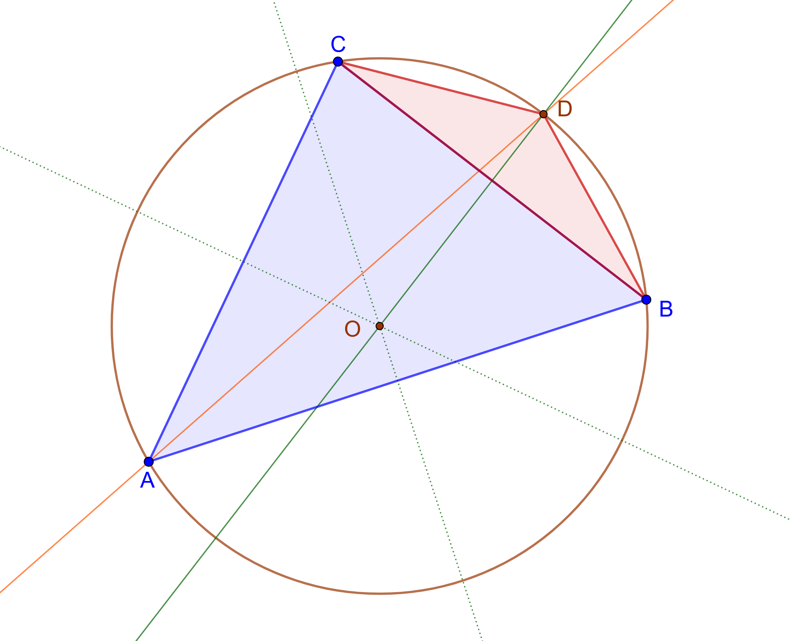

## Hodina 12. januára 2024

Program:

1. Domáca úloha (z minula)
2. Niekoľko príkladov na zahriatie a pozdvihnutie mysli: matice
3. Poznámky k maticiam: row reduction, násobenie maticou, lineárna regresia
4. Domáca úloha (nová)
5. Program na budúci týždeň

### 0. Úvod

**Tento text** a texty k nasledujúcim cvičeniam budú vyložené - ako pdf - v Github repozitári https://github.com/PKvasnick/Erik. Odporúčam Github Desktop (na Windows) pre uloženie a synchronizáciu repozitára. 

**Videohovor** Používame SpeakApp, link postnem vždy pred hodinou, *_je možné, že sa bude týždeň od týždňa líšiť_*.

---

### 1. Domáca úloha

**Príklad 1**

Dokážte, že v trojuholníku ABC leží priesečník osi uhla $\beta$ (pri vrchole B) a osi strany $b$ (oproti vrcholu B) na kružnici opísanej trojuholníku. 

**Riešenie**

Tento bod sa v českej a slovenskej matematickej literatúre označuje ako Švrčkov bod, a pravdaže každý trojuholník má tri takéto body. 

Poďme si najskôr ozrejmiť, ako môžeme dokázať, že dva body sú totožné. V našom prípade vieme, že ľubovoľný body X ležiaci na osi strany BC tvorí s bodmi BC rovnoramenný trojuholník. Preto na dôkaz tvrdenia potrebujeme dokázať, že priesečník osi uhla $\alpha = \angle BAC$ s opísanou kružnicou vytvára rovnoramenný trojuholník $BCD$. Potom musí bodom D prechádzať aj os strany BC. 

Vlastný dôkaz: Uhol $\angle BAD$ a uhol $\angle BCD$ sú obvodové uhly, prislúchajúce tetive BD a sú teda rovnaké a rovné $\alpha/2$, pretože AD je os uhla $\alpha \equiv \angle BAC$. Podobne platí $\angle DCB = \angle CAD = \alpha/2$. Trojuholník $CBD$ je teda rovnoramenný a os strany BC musí predchádzať vrcholom D. Tým je tvrdenie dokázané. 

---

**Príklad 2**

Vezmime ľubovoľný bod P vnútri rovnostranného trojuholníka. Dokážte že súčet jeho vzdialeností od strán trojuholníka je rovný výške trojuholníka (teda je pre všetky body vnútri trojuholníka rovnaký).

**Riešenie**

Toto tvrdenie sa nazýva Vivianiho veta a dôkaz je ľahký:

Jediné, čo treba, je vypočítať dvoma spôsobmi obsah trojuholníka:
$$
S_{ABC} = \frac{1}{2}cv_c = \frac{1}{2}cv_{AB} + \frac{1}{2}av_{BC} + \frac{1}{2}bv_{AC}
$$
a pretože máme rovnostranný trojuholník a $a=b=c$, musí platiť
$$
v_c = v_{AB} + v_{BC} + v_{AC}
$$
Takto možno kresliť grafy vlastností ternárnych zmesí, pre ktoré molárne zlomky zložiek dávajú spolu 1 a takto vieme prirodzene nakresliť závislosť od 3 viazaných parametrov nakresliť do trojuholníka. 

Hoa, hoa, ale tu sa vzdialenosti merajú inak! Ako vieme, že aj pre takéto vzdialenosti platí Vivianiho veta? 

Odpoveď: vzidalenosti sa líšia od kolmých vzdialeností o konštantný faktor $1/\cos{60°}$. Ich obrovská výhoda je, že ich vieme jednoducho zostrojiť. 

**Zovšeobecnenie** Platí niečo podobné pre všeobecný trojuholník?

---

## Niekoľko príkladov na zahriatie a povznesenie mysle

### Matice: Redukcia po riadkoch (row reduction)

Pokračujeme z minula:

**Problém 3**

Továreň vyrába osobné autá, nákladné autá a autobusy. Tri hlavné suroviny, ktoré používa, sú oceľ,  sklo a plasty.  Nasledujúca tabuľka obsahuje množstvo surovín, potrebných na jednotlivé výrobky, vo vhodných jednotkách:

|       | Osobné auto | Nákladné auto | Autobus |
| :---: | :---------: | :-----------: | :-----: |
| Oceľ  |      1      |       4       |    6    |
| Sklo  |      2      |       3       |   20    |
| Plast |      3      |       5       |   15    |

Denne sa v priemere spotrebuje 48 jednotiek ocele, 113 jednotiek skla a 111 jednotiek plastov. Koľko osobných áut, nákladných áut a autobusov sa priemerne denne vyrobí?

**Riešenie** Označme $c, t, b$ priemerný počet denne vyrobených osobných áut, nákladných áut a autobusov (*c*ars, *t*rucks, *b*usses).  Tabuľka spotreby materiálov pre jednotlivé výrobky nám dáva sústavu lineárnych rovníc pre $c, t, b$:
$$
\begin{pmatrix}
	1 & 4 & 6 \\
	2 & 3 & 20 \\
	3 & 5 & 15 
\end{pmatrix}
\cdot
\begin{pmatrix}
	c \\
	t \\
	b
\end{pmatrix}
=
\begin{pmatrix}
	48 \\
	113 \\
	111 
\end{pmatrix}
$$
a riešime zase zostrojením augmentovanej matice a jej uvedením do RREF tvaru:
$$
\left(
    \begin{array}{ccc|c}
        1 & 4 & 6 & 48 \\
        2 & 3 & 20 & 113 \\
        3 & 5 & 15 & 111 \\
    \end{array}
\right) \xrightarrow{R_2-=2R_1}
\left(
    \begin{array}{ccc|c}
        1 & 4 & 6 & 48 \\
        0 & -5 & 8 & 17 \\
        3 & 5 & 15 & 111 \\
    \end{array}
\right) \xrightarrow{R_3-=3R_1}
\left(
    \begin{array}{ccc|c}
        1 & 4 & 6 & 48 \\
        0 & -5 & 8 & 17 \\
        0 & -7 & -3 & -33 \\
    \end{array}
\right) \\ \xrightarrow{R_3=5R_3 - 7R_2}
\left(
    \begin{array}{ccc|c}
        1 & 4 & 6 & 48 \\
        0 & -5 & 8 & 17 \\
        0 & 0 & -71 & -284 \\
    \end{array}
\right) \xrightarrow{R_3/=-71}
\left(
    \begin{array}{ccc|c}
        1 & 4 & 6 & 48 \\
        0 & -5 & 8 & 17 \\
        0 & 0 & 1 & 4 \\
    \end{array}
\right) \\ \xrightarrow{R_2-=8R_3}
\left(
    \begin{array}{ccc|c}
        1 & 4 & 6 & 48 \\
        0 & -5 & 0 & -15 \\
        0 & 0 & 1 & 4 \\
    \end{array}
\right) \xrightarrow{R_2/=-5}
\left(
    \begin{array}{ccc|c}
        1 & 4 & 6 & 48 \\
        0 & 1 & 0 & 3 \\
        0 & 0 & 1 & 4 \\
    \end{array}
\right) \xrightarrow{R_1-=4R_2 + 6R_3}
\left(
    \begin{array}{ccc|c}
        1 & 0 & 0 & 12 \\
        0 & 1 & 0 & 3 \\
        0 & 0 & 1 & 4 \\
    \end{array}
\right) 
$$
V priemere sa teda vyrobí 12 osobných, 3 nákladné automobily a 4 autobusy. 

*Poznámka* V tomto prípade sme mali šťastie a vyhli sme sa zásadnému problému takýchto úloh: ako zabezpečiť, aby sme dostali $c, t, b \ge 0$? Typicky sa takáto úloha rieši tak, že hľadáme projekciu riešenia lineárneho systému do podpriestoru $c, t, b \ge 0$ - najbližší vektor k vektoru riešenia, ktorý už leží v požadovanom podpriestore. 

---

## Matice et al.

### 1. Prečo funguje redukcia po riadkoch?

Ekvivalentné úpravy: ľubovoľný riadok alebo stĺpec matice môžeme nahradiť lineárnou kombináciou všetkých riadkov či stĺpcov.

**Čo robíme, keď robíme ekvivalentné úpravy matice?**

Riešili sme minulý týždeň takéto veci:
$$
\left(
    \begin{array}{ccc|c}
        1 & 1 & 1 & 3 \\
        4 & 2 & 1 & -1 \\
        9 & 3 & 1 & 5 \\
    \end{array}
\right) \xrightarrow{R_2-=4R_1}
\left(
    \begin{array}{ccc|c}
        1 & 1 & 1 & 3 \\
        0 & -2 & -3 & -13 \\
        9 & 3 & 1 & 5 \\
    \end{array}
\right) \rightarrow
\dots
$$
Aká matica by previedla pôvodnú maticu vľavo na maticu vpravo? Nechávame prvý a tretí riadok nezmenený, teda tá matica bude mať na diagonále v pozícíách 1 a 3 jednotky, a v 1. a 3. riadku budú okrem toho samé nuly. Na druhom riadku chceme  $(-4)\cdot$ prvý riadok + $1\cdot$ druhý riadok, takže výsledok bude vyzerať nejako takto:
$$
\left(
    \begin{array}{ccc}
        1 & 0 & 0 \\
        -4 & 1 & 0 \\
        0 & 0 & 1 \\
    \end{array}
\right)
\cdot
\left(
    \begin{array}{ccc|c}
        1 & 1 & 1 & 3 \\
        4 & 2 & 1 & -1 \\
        9 & 3 & 1 & 5 \\
    \end{array}
\right)
=
\left(
    \begin{array}{ccc|c}
        1 & 1 & 1 & 3 \\
        0 & -2 & -3 & -13 \\
        9 & 3 & 1 & 5 \\
    \end{array}
\right)
$$
Úplne podobne to je s ostatnými úpravami: všetky ekvivalentné úpravy môžeme chápať ako násobenie nejakou maticou. 

**Čo je augmentovaná matica?**

Môžeme si predstaviť, že maticovú rovnicu $\mathbf{Ax}=\mathbf{b}$ rozpíšeme po stĺpcoch ako
$$
\begin{pmatrix}
	a_{1,1} \\ a_{2,1} \\ a_{3,1}
\end{pmatrix}
x_1 +
\begin{pmatrix}
	a_{2,1} \\ a_{2,2} \\ a_{3,2}
\end{pmatrix}
x_2 +
\begin{pmatrix}
	a_{1,3} \\ a_{2,3} \\ a_{3,3}
\end{pmatrix}
x_3 -
\begin{pmatrix}
	b_1 \\ b_2 \\ b_3
\end{pmatrix} = 
\begin{pmatrix}
	a_{1,1} & a_{1,2} & a_{1,3} & b_1 \\
	a_{2,1} & a_{2,2} & a_{2,3} & b_2 \\
	a_{3,1} & a_{3,2} & a_{3,3} & b_3 \\
\end{pmatrix}
\cdot
\begin{pmatrix}
	x_1 \\ x_2 \\ x_3 \\ -1
\end{pmatrix}
= 0
$$
Ak rovnosť vpravo násobíme maticou s nenulovým determinantom, jej platnosť sa nezmení: bude platiť práve vtedy, ako $\mathbf{x}$ je riešením sústavy. 

**Čo všetky tie operácie, ktoré robíme pri uvádzaní matice do RREF?**

Pri uvádzaní matice do diagonálneho tvaru násobíme obe strany sústavy $\mathbf{Ax}=\mathbf{b}$ postupne maticami $\mathbf{T_1, T_2, \dots}$, ktoré zodpovedajú jednotlivým operáciám s riadkami:
$$
\mathbf{T_1T_2\dots\cdot Ax} = \mathbf{T_1T_2\dots\cdot b}
$$
Cieľom je uviesť $\mathbf{A}$ do diagonálneho tvaru. Teda $\mathbf{T_1T_2\dots\cdot A}= \mathbf{I}$ a to znamená, že $\mathbf{T_1T_2\dots = A^{-1}}$ a teda dostávame $\mathbf{x} = \mathbf{A^{-1}b}$. Inak povedané, riadkovými úpravami vlastne vytvárame inverznú maticu. 

Na tomto princípe je založené počítanie inverznej matice pomocou riadkových úprav, kedy augmentovaná matica obsahuje naľavo $\mathbf{A}$ a vpravo jednotkovú maticu, a riadkovými úpravami sa snažíme dosiahnuť naľavo jednotkovú maticu, ako pri riešení sústavy rovníc. Potom matica vpravo je i$\mathbf{A^{-1}}$.

Príklad:
$$
\left(
\begin{array}{cc|cc}
a & b & 1 & 0 \\
c & d & 0 & 1
\end{array}
\right) 
\xrightarrow{R_2 \rightarrow aR_2 - cR_1}
\left(
\begin{array}{cc|cc}
a & b & 1 & 0 \\
0 & ad - bc & -c & a
\end{array}
\right) \\
\xrightarrow{R_1 \rightarrow (ad-bc)aR_1 - bR_2}
\left(
\begin{array}{cc|cc}
(ad-bc)a & 0 & ad & -ba \\
0 & ad - bc & -c & a
\end{array}
\right) \\
\xrightarrow{R_1 \rightarrow R_1/a(ad-bc), R_2 \rightarrow R_2/(ad-bc)}
\left(
\begin{array}{cc|cc}
(1 & 0 & \frac{d}{ad-bc} & \frac{-b}{ad-bc} \\
0 & 1 & \frac{-c}{ad-bc} & \frac{a}{ad-bc}
\end{array}
\right)
$$
a teda 
$$
\begin{pmatrix} a & b \\ c & d\end{pmatrix}^{-1} = \frac{1}{D}\begin{pmatrix} d & -b \\ -c & a\end{pmatrix}, \quad D = ad - bc
$$

---

### 2. Determinanty

**Príklad**

Máme v rovine 3 body $A=[x_1, y_1], B=[x_2, y_2], C=[x_3, y_3]$. Obsah trojuholníka $ABC$ je 
$$
\pm \frac{1}{2}\begin{array}{|ccc|}
	x_1 & x_2 & x_3 \\ 
	y_1 & y_2 & y_3 \\
	1 & 1 & 1
\end{array}
$$
kde $\pm$ vyjadruje neistotu ohľadne znamienka, ktoré závisí od toho, ako si označíme body trojuholníka. 

To vyzerá ako nejaká projektívna geometria, máme tam afínne súradnice bodov. Z 3D predstavy ľahko pochopíme aj to, ako tento vzťah funguje. 

Tento vzťah je zároveň aj dobrý test kolinearity bodov $A, B, C$.

#### Výpočet 1

Zhora doprava -zdola doprava

**Príklad**
$$
\begin{array}{|ccc|}
	5 & -1 & 3 \\
	7 & 2 & 4 \\
	6 & 0 & 1
\end{array}
\quad \rightarrow \quad 
\begin{array}{|ccc|cc}
	5 & -1 & 3 & 5 & -1 \\
	7 & 2 & 4 & 7 & 2 \\
	6 & 0 & 1 & 6 & 0 
\end{array} \\
$$

$$
\rightarrow \quad
[5\cdot 2 \cdot 1 +(-1)\cdot 4 \cdot 6 + 3 \cdot 7 \cdot 0] - [6\cdot 2 \cdot 3 + 0 \cdot 4 \cdot 5 + 1 \cdot 7 \cdot (-1)]
= \\
(10-24) - (36-7) = -14 - 29 = -43
$$

**Príklad**
$$
\begin{array}{|ccc|}
	-2 & 5 & -1 \\
	0 & 1 & 3 \\
	4 & 0 & 6
\end{array}
\quad
(52)
$$

#### Výpočet 2

Rozvoj podľa riadku alebo stlpca:
$$
\begin{array}{|ccc|}
	5 & -1 & 3 \\
	7 & 2 & 4 \\
	6 & 0 & 1
\end{array} = 
5 \cdot \begin{array}{|cc|}
	2 & 4 \\
	0 & 1
\end{array}
- (-1) \cdot \begin{array}{|cc|}
	7 & 4 \\
	6 & 1
\end{array}
+ 3 \cdot \begin{array}{|cc|}
	7 & 2 \\
	6 & 0
\end{array} \\
$$

$$
= 5 \cdot 2 + 1. \cdot (-17) + 3 \cdot (-12) = -43
$$

Formálne: 
$$
\det{A} = \sum_j a_{i,j}C_{i,j}= \sum_j a_{i,j}(-1)^{i+j}M_{i,j}
$$
kde $M_{i,j}$ je minor pre prvok $a_{i,j}$, teda determinant matice s vynechaným i-tym riadkom a j-tym stĺpcom. 

#### Výpočet 3

Predchádzajúce spôsoby sa hodia pre malé matice (pre veľké nemáme ani skratku z 1. výpočtu) a okrem toho takto počítať determinanty je numericky veľmi neefektívne -je tam fakt veľa násobení a odčítajú sa tam hlava-nehlava potenciálne veľké čísla, a to je pre počítanie v plávajúcej čiarke zhubné. 

Metóda rozvoja podľa kofaktorov či minorov by bola zvlášt atraktívna, ak by sme mali v matici veľa núl. Napríklad ak by matica bola dolná trojuholníková, potrebovali by sme iba vynásobiť diagonálne prvky, a podobne to je aj pri hornej trojuholníkovej matici:
$$
\begin{array}{|cccc|}
a & 0 & 0 & 0 \\
b & c & 0 & 0 \\
d & e & f & 0 \\
g & h & i & j
\end{array} = acfj,
\quad
\begin{array}{|cccc|}
a & b & c & d \\
0 & e & f & g \\
0 & 0 & h & i \\
0 & 0 & 0 & j
\end{array} = 
= aehj
$$
Niečo také sme už robilii, a stálo by za to mať takú možnosť pri výpočte determinantov. Musíme sa preto pozrieť, aký vplyv majú riadkové a stĺpcové operácie na determinant matice.

**Základné tvrdenie**
$$
\mathbf{|A\cdot B|}=\mathbf{|A|}\cdot \mathbf{|B|}
$$
**Príklad**

Majme maticu 
$$
A = \begin{array}{|cc|}
1 & 2 \\
3 & 4
\end{array}
$$
Operácia výmeny riadkov:
$$
\begin{pmatrix}
0 & 1 \\
1 & 0
\end{pmatrix}
\cdot
\begin{pmatrix}
1 & 2 \\
3 & 4
\end{pmatrix}
= 
\begin{pmatrix}
3 & 4 \\
1 & 2
\end{pmatrix}
$$
a tak máme
$$
\begin{array}{|cc|}
	1 & 2 \\ 3 & 4
\end{array}
= -2
= \frac{1}{
\begin{array}{|cc|}
	0 & 1 \\ 1 & 0
\end{array}}
\cdot
\begin{array}{|cc|}
	3 & 4 \\ 1 & 2
\end{array}
= \frac{1}{-1}\cdot 2 
$$
Vo všeobecnosti výmena riadkov matice vedie k determinantu s hodnotou 
$$
(-1)^\textit{celkový počet výmien susedných riadkov}
$$
Tu máme jednu výmenu susedných riadkov, takže násobíme (-1). 

Podobne operácia zámeny riadka lineárnou kombináciou ostatných:
$$
\begin{pmatrix}
	1 & 2 \\ 3 & 4
\end{pmatrix}
\xrightarrow{R_2 \rightarrow R_2 - 3R_1}
\begin{pmatrix}
	1 & 2 \\
	0 & -2
\end{pmatrix} = 
\begin{pmatrix}
	1 & 0 \\ -3 & 1
\end{pmatrix}
\cdot
\begin{pmatrix}
	1 & 2 \\ 3 & 4
\end{pmatrix}
$$
a teda
$$
\begin{array}{|cc|}
	1 & 2 \\ 3 & 4
\end{array} 
=
\frac{1}{
\begin{array}{|cc|}
	1 & 0 \\ -3 & 1
\end{array}
} \cdot
\begin{array}{|cc|}
	1 & 2 \\ 0 & - 2
\end{array}
= \frac{1}{1}\cdot (-2) = -2
$$
Môže to vyzerať ako zložité - zjednodušujeme počítanie determinantu tak, že počítame hromadu ďalších determinantov. Už sme si ale ukázali, ako upraviť znamienko pri výmene riadkov, a ak odčítame násobky riadkov zhora nadol alebo zhora nadol, budú všetky takéto operácie dávať determinanty dolných (resp. horných) trojuholníkových matíc a budú mať hodnotu 1. 

**Príklad**

Vypočítajte determinant
$$
D = \begin{array}{|cccc|}
	3 & 1 & 4 & 10 \\
    2 & -1 & 6 & 3 \\
    0 & 5 & 3 & -2 \\
    1 & 0 & 1 & 5
\end{array}
$$
**Riešenie**

Budem písať aj príslušné determinanty, zodpovedajúce riadkovým operáciám.

1. Štvrtý riadok má na začiatku 1, tak ho presunieme nahor. Sú to tri výmeny susedných riadkov, takže 

$$
D = - \begin{array}{|cccc|}
    1 & 0 & 1 & 5 \\
	3 & 1 & 4 & 10 \\
    2 & -1 & 6 & 3 \\
    0 & 5 & 3 & -2
\end{array}
$$

pretože príslušný determinant matice, posúvajúcej štvrtý riadok nahor, je
$$
\begin{array}{|cccc|}
    0 & 0 & 0 & 1 \\
	1 & 0 & 0 & 0 \\
    0 & 1 & 0 & 0 \\
    0 & 0 & 1 & 0
\end{array} = -1
$$

2. Odčítame trojnásobok prvého riadku matice od 2. riadku:

$$
D = - \begin{array}{|cccc|}
    1 & 0 & 1 & 5 \\
	0 & 1 & 1 & -5 \\
    2 & -1 & 6 & 3 \\
    0 & 5 & 3 & -2
\end{array}
$$

Nemáme žiadny korekčný faktor, pretože determinant matice príslušnej operácie je
$$
\begin{array}{|cccc|}
    1 & 0 & 0 & 0 \\
	-3 & 1 & 0 & 0 \\
    0 & 0 & 1 & 0 \\
    0 & 0 & 0 & 1
\end{array} = 1
$$

3. Odpočítame dvojnásobok prvého riadku od tretieho riadku:

$$
D = - \begin{array}{|cccc|}
    1 & 0 & 1 & 5 \\
	0 & 1 & 1 & -5 \\
    0 & -1 & 4 & -7 \\
    0 & 5 & 3 & -2
\end{array}
$$

Opäť nemáme žiadny korekčný faktor, pretože determinant matice príslušnej operácie je
$$
\begin{array}{|cccc|}
    1 & 0 & 0 & 0 \\
	0 & 1 & 0 & 0 \\
    -2 & 0 & 1 & 0 \\
    0 & 0 & 0 & 1
\end{array} = 1
$$

4. Pripočítame k tretiemu riadku druhý:

$$
D = - \begin{array}{|cccc|}
    1 & 0 & 1 & 5 \\
	0 & 1 & 1 & -5 \\
    0 & 0 & 5 & -12 \\
    0 & 5 & 3 & -2
\end{array}
$$

a determinant zodpovedajúci príslušnej operácie je
$$
\begin{array}{|cccc|}
    1 & 0 & 0 & 0 \\
	0 & 1 & 0 & 0 \\
    0 & 1 & 1 & 0 \\
    0 & 0 & 0 & 1
\end{array} = 1
$$

5. Odpočítame 5-násobok 2. riadku od 4. riadku:

$$
D = - \begin{array}{|cccc|}
    1 & 0 & 1 & 5 \\
	0 & 1 & 1 & -5 \\
    0 & 0 & 5 & -12 \\
    0 & 0 & -2 & 23
\end{array}
$$

a determinant od tejto operácie je zase
$$
\begin{array}{|cccc|}
    1 & 0 & 0 & 0 \\
	0 & 1 & 0 & 0 \\
    0 & 0 & 1 & 0 \\
    0 & -5 & 0 & 1
\end{array} = 1
$$

6. Vydelíme 3. riadok piatimi:

$$
D = -5\cdot \begin{array}{|cccc|}
    1 & 0 & 1 & 5 \\
	0 & 1 & 1 & -5 \\
    0 & 0 & 1 & -12/5 \\
    0 & 0 & -2 & 23
\end{array}
$$

pretože determinant od tejto operácie je 
$$
\begin{array}{|cccc|}
    1 & 0 & 0 & 0 \\
	0 & 1 & 0 & 0 \\
    0 & 0 & 1/5 & 0 \\
    0 & 0 & 0 & 1
\end{array} = 1/5
$$

7. Pripočítame dvojnásobok tretieho riadku ku štvrtému:

$$
D = -5\cdot \begin{array}{|cccc|}
    1 & 0 & 1 & 5 \\
	0 & 1 & 1 & -5 \\
    0 & 0 & 1 & -12/5 \\
    0 & 0 & 0 & 91/5
\end{array} = -5 \cdot \frac{91}{5} = -91
$$

### 3. **Čo robí násobenie maticou?**

Môžeme vziať nejakú plochu v rovine, vziať niekoľko vektorov, ktoré v nej končia, transformovať ich pomocou matice a pozrieť sa, v akej oblasti sa nachádzajú. Napríklad si môžeme vziať maticu 
$$
\mathbf{A}= \begin{pmatrix}
1 & -1 \\
1/2 & 1
\end{pmatrix}
$$
a pozrieť sa, čo sa stane s jednotkovým štvorcom:

Zväčšenie plochy je dané *determinantom* matice, teda červený rovnobežník má plochu 1.5-krát väčšiu ako modrý, ako ľahko vidieť z obrázku. Táto vlastnosť je veľmi všeobecná, nezávisí od polohy v priestore ani od tvaru východiskovej oblasti.

Dokážeme pre náš prípad:

Strany štvorca sa transformujú na strany rovnobežníka takto:
$$
\vec{a^{\prime}} \equiv \vec{AB^{\prime}}  = 
\begin{pmatrix}
	1 & -1 \\
	1/2 & 1
\end{pmatrix} 
\cdot
\begin{pmatrix}
	1 \\ 0
\end{pmatrix} 
=
\begin{pmatrix}
	1 \\ 1/2
\end{pmatrix} ,
\\
\vec{b^{\prime}} \equiv \vec{AD^{\prime}}  = 
\begin{pmatrix}
	1 & -1 \\
	1/2 & 1
\end{pmatrix} 
\cdot
\begin{pmatrix}
	0 \\ 1
\end{pmatrix} 
=
\begin{pmatrix}
	-1 \\ 1
\end{pmatrix}
$$
Plochu červeného rovnobežníka ľahko vypočítame ako vektorový súčin, teda
$$
\vec{a^{\prime}} \times \vec{b^{\prime}} \equiv
\begin{array}{|ccc|}
	\vec{i} & \vec{j} & \vec{k} \\
	1 & 1/2 & 0 \\
	-1 & 1 & 0
\end{array} = 
\vec{k}\det \mathbf{A}
$$
Determinant je zvláštna funkcia:

- je to lineárna funkcia N vektorových argumentov
- je antisymetrická vo všetkých dvojiciach argumentov - teda vzájomná výmena dvoch argumentov zmení znamienko determinantu.

Dá sa ukázať, že taká funkcie je (až na konštantný faktor) jediná. 

**Stopa**

Stopa matice (alebo iného operátora) $\mathbf{A}$ je lineárny člen rozvoja determinantu $|1+\epsilon \mathbf{A}|$ podľa $\epsilon$. 

Príklad:
$$
|1 + \epsilon\mathbf{A}| \equiv 
\begin{array}{|cc|}
1 + \epsilon & -\epsilon \\
1/2 \cdot \epsilon & 1 + \epsilon
\end{array} =
1 + 2\epsilon + O(\epsilon^2)
$$
takže stopa matice A je 2, a ľahko vidno, že to je súčet diagonálnych prvkov. Napriek tomu, že vyzerá triviálne, stopa je veľmi dôležitá veličina.

### Lineárna regresia

V prípade lineárnej regresie máme preurčenú sústavu lineárnych rovníc:
$$
\begin{pmatrix}
	x_1^2 & x_1 & 1 \\
	x_2^2 & x_2 & 1 \\
	x_3^2 & x_3 & 1 \\
	& \cdots & \\
	x_n^2 & x_n & 1 \\
\end{pmatrix}
\cdot
\begin{pmatrix}
	a_2\\
	a_1\\
	a_0
\end{pmatrix}
=
\begin{pmatrix}
	y_1 \\
	y_2 \\
	y_3 \\
	\cdots \\
	y_n 
\end{pmatrix}
\quad
\text{resp.}
\quad
\mathbf{F}\mathbf{\beta} = \mathbf{Y}
$$
Používame štandardné označenie $\mathbf{F}$ pre maticu faktorov, ktorej členy závisia od hodnôt $x_i$, a maticu parametrov $\beta$.  Rovnica dáva zmysel, iba ak nadbytočné dáta sú zbytočné a hovoria to isté.  Ak hovoria niečo iné, úloha nemá riešenie. Môžeme sa ale pozrieť na úlohu tak, že chceme nájsť takú krivku, definovanú parametrami $a_i$, pre ktorú je súčet štvorcov odchýlok hodnôt y najmenší, teda 
$$
\mathrm{\hat{\beta}} = \textrm{argmin}\left[(\mathbf{Y}-\mathbf{F}\mathbf{\beta})^T(\mathbf{Y}-\mathbf{F}\mathbf{\beta})\right]
$$
Riešenie si vyžaduje trošku zložitejšie derivovanie, ale vyzerá takto:
$$
\mathbf{(F^T F)\beta} = \mathbf{F^T Y} \quad \therefore \quad \mathbf{\beta} = \mathbf{(F^T F)^{-1}F^T Y}
$$
V skutočnosti ale neformulejeme problém ako minimalizáciu skalárneho súčinu, ale ako minimalizáciu stopy:
$$
\mathrm{\hat{\beta}} = \textrm{argmin Tr}\left[(\mathbf{Y}-\mathbf{F}\mathbf{\beta})(\mathbf{Y}-\mathbf{F}\mathbf{\beta})^T\right]
$$
Stopa matice $Tr$ je súčet jej diagonálnych prvkov. Toto je všeobecnejší výraz, ktorý funguje v širšej škále prípadov, a jeho minimalizácia podľa $\mathbf{\beta}$ je určitým spôsobom ľahšia. 

---

##  Domáca úloha (nová) 

1. Dokážte, že v ľubovoľnom trojuholníku platí $\tan{\alpha} + \tan{\beta} + \tan{\gamma} = \tan{\alpha} \cdot \tan{\beta} \cdot \tan{\gamma}$.

2. Máme v rovine bod S, kružnicu k a priamku p. Zostrojte štvorec ABCD tak, že S je priesečník jeho uhlopriečok, A leží na k a B leží na p. 

   

---

## 5. Program na budúci týždeň

- Ešte lineárna algebra: eigen...

$$
\bar{a}
$$

